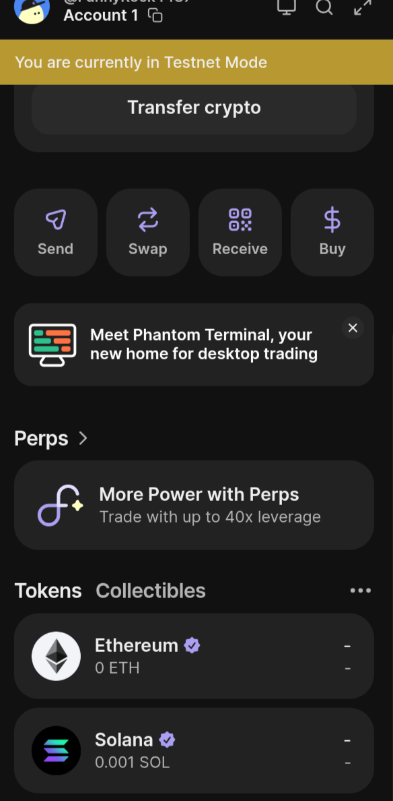

# 100 days of Rust DeFi
## Week 1: Blockchain Foundamentals

Basic concepts:
Block:
- Information about confirmed transactions.
- Header: hash of previous block, timestamps, Mekle root (hash of all block transactions), Nonce, Difficulity target, Version, and more...

Hash:
- SHA256 (or another algoritm) of block header.
- One direction function - non reversible.

Validation
- Comparing new transaction with self stored Blockchain. Check all blockchain rules.
- Check PoW.
- Verify merkle root.
- Verify previous hash.

Specific to Solana:
- Slot (~400ms - 800ms) when the leader can make a block.
- PoH (Proof of History). It profs that the time moves by making continous hashing with timestamps. It is a cryptographic clock.
- Continous hashing: hash_n = hash(hash_n-1 + timestamp)
- Transaction added to PoH hashing.

## 📊 Week 1 Progress (Days 1-4)
- ✅ **Day 1**: Blockchain basics (Feynman)
- ✅ **Day 2**: PoS vs PoW ASCII art
- ✅ **Day 3**: Smart contracts (vending machine)
- ✅ **Day 4**: Portfolio structure 📁

**Anki stats**: [HERE screenshot]

## Day 5: First Solana Transaction 👻

**Phantom wallet setup complete!**

1. ✅ Wallet created (devnet)
2. ✅ Airdropped 2 SOL 
3. ✅ Sent 0.001 SOL tx → [explorer.solana.com/tx/SIGNATURE]
   

**Anki stats**: [screenshot]
